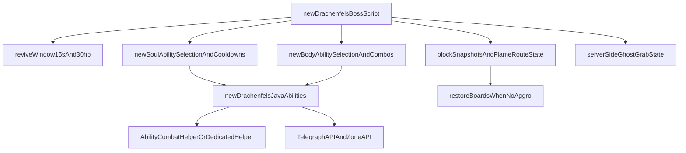

# План по Drachenfels

## Что уже есть

- В [C:\Waha\Waha1.16.5\WFMCustomNPCPlus1.16.5\src\main\resources\scripts\drachenfels\drachenfels_boss.js](C:\Waha\Waha1.16.5\WFMCustomNPCPlus1.16.5\src\main\resources\scripts\drachenfels\drachenfels_boss.js) уже существует парная логика `body/spirit`, `Immortal Bond`, forced-cast и revive-окно. Но по вашему уточнению это будет не место правок, а референс, из которого нужно вынести удачные части в новый отдельный скрипт для новой версии босса.
- Тяжёлые боевые механики уже делаются через Java ability в [C:\Waha\Waha1.16.5\WFMCustomNPCPlus1.16.5\src\main\java\noppes\npcs\abilities\impl](C:\Waha\Waha1.16.5\WFMCustomNPCPlus1.16.5\src\main\java\noppes\npcs\abilities\impl) и вызываются из `AbilityAPI.start(...)` в `drachenfels_boss.js`.
- Telegraph/Zone стек уже есть: [TelegraphAPI.java](C:\Waha\Waha1.16.5\WFMCustomNPCPlus1.16.5\src\main\java\noppes\npcs\telegraph\TelegraphAPI.java), [ZoneAPI.java](C:\Waha\Waha1.16.5\WFMCustomNPCPlus1.16.5\src\main\java\noppes\npcs\zone\ZoneAPI.java), [EntityAbilityZone.java](C:\Waha\Waha1.16.5\WFMCustomNPCPlus1.16.5\src\main\java\noppes\npcs\entity\EntityAbilityZone.java). Но сейчас зоны и часть helper-урона не дают именно «чистый» урон, поэтому для ваших механик понадобится отдельная серверная утилита урона.

## Архитектура реализации

## Разбиение по механикам

- `Revive 15s / 30% HP`: перенести текущую структуру revive из [drachenfels_boss.js](C:\Waha\Waha1.16.5\WFMCustomNPCPlus1.16.5\src\main\resources\scripts\drachenfels\drachenfels_boss.js) в новый отдельный orchestration-script и уже в нём выставить нужные тайминги и HP. Старый скрипт остаётся как референс и fallback.
- `1. Тёмный взрыв по кругу под игроком`: новая Java-абилка Души. Она должна:
  - зафиксировать точку под целью на charge;
  - показать круглый telegraph;
  - нанести 15 чистого урона;
  - разрушить только деревянные доски внутри радиуса;
  - сохранить snapshot разрушенных блоков в encounter-state, чтобы их можно было вернуть, когда оба босса не в агре.
  Основные файлы: новые `Drachenfels...Ability.java`, плюс расширение helper/state в [AbilityParamKeys.java](C:\Waha\Waha1.16.5\WFMCustomNPCPlus1.16.5\src\main\java\noppes\npcs\abilities\AbilityParamKeys.java), [AbilityDefaults.java](C:\Waha\Waha1.16.5\WFMCustomNPCPlus1.16.5\src\main\java\noppes\npcs\abilities\AbilityDefaults.java), [AbilityRegistry.java](C:\Waha\Waha1.16.5\WFMCustomNPCPlus1.16.5\src\main\java\noppes\npcs\abilities\AbilityRegistry.java).
- `2. Ритуал выравнивания HP`: лучше делать как encounter-specific orchestration в новом скрипте, а не как универсальную ability. Причина: механика жёстко привязана к двум конкретным NPC и фиксированным координатам `24379 28 -60298` / `+5Y`.
План: новый JS-скрипт переводит Тело и Душу в ритуальные позиции, спавнит particle-link, временно фиксирует обоих, а серверный helper аккуратно переносит HP от более здоровой части к менее здоровой так, чтобы слабая часть заметно отхилилась, а сильная потеряла лишь малую долю.
- `3. Призрак-паразит`: делать как серверную механику без клиентских пакетов. План:
  - Душа запускает homing-призрака в сторону игрока;
  - при контакте на игрока вешается server-side grab state;
  - пока state активен, игрок удерживается на месте, ему сбрасывается motion и наносится 2 чистого урона в секунду;
  - отдельная сущность/маркер-призрак остаётся у жертвы и может быть убита, что снимает захват.
  Это потребует либо новой ability + отдельного handler-а на серверных тиках, либо ability с собственным runtime-state. Скорее всего чище вынести тиковую часть в новый handler рядом с [AbilityTickHandler.java](C:\Waha\Waha1.16.5\WFMCustomNPCPlus1.16.5\src\main\java\noppes\npcs\abilities\event\AbilityTickHandler.java).
- `4. Четыре огненные зоны по маршруту`: это encounter-механика арены, поэтому лучше держать её в новом JS orchestration-script, используя [ZoneAPI.java](C:\Waha\Waha1.16.5\WFMCustomNPCPlus1.16.5\src\main\java\noppes\npcs\zone\ZoneAPI.java) как runtime. В новом скрипте будет храниться состояние 4 точек:
  - `24394 28 -60298`
  - `24362 28 -60298`
  - `24379 28 -60314`
  - `24379 28 -60282`
  Зоны будут циклически смещаться по маршруту, визуально выпускать огонь и наносить 5 чистого урона в секунду + поджог. Для соответствия вашему «чистому» урону либо расширим `EntityAbilityZone`, либо сделаем отдельную серверную periodic-hit логику поверх zone entity.
- `5. Стяжка в Тело -> круговой взрыв -> сразу следующее заклинание`: новая body ability в Java. План:
  - Тело притягивает всех игроков в радиусе к себе серверной логикой;
  - сразу после этого спавнит круглый telegraph/zone под собой;
  - после короткой задержки зона наносит 15 чистого урона;
  - по завершении ability новый orchestration-script принудительно запускает второе body-заклинание без обычного roll в `pickAbility`.
  Это лучше разделить на Java ability для pull+AoE и новый JS orchestration-script для follow-up combo, чтобы не зашивать encounter sequence внутрь generic ability.
- `6. Проклятие на 3 игроков и 3 лужи-очистителя`: новая body ability как гибрид Java + JS state. План:
  - ability выбирает до 3 игроков-целей;
  - на каждую цель вешается curse-state на 10 секунд;
  - параллельно спавнятся 3 лужи в случайных допустимых точках арены;
  - если проклятый игрок входит в любую свободную лужу, curse снимается и лужа исчезает;
  - если таймер истёк, а curse не снят, босс лечится на 10 HP за этого игрока.
  Основная encounter-state логика и таймеры лучше держать в новом скрипте, а визуальную/боевую часть луж опереть на [ZoneAPI.java](C:\Waha\Waha1.16.5\WFMCustomNPCPlus1.16.5\src\main\java\noppes\npcs\zone\ZoneAPI.java) либо на лёгкий кастомный zone-state, если нужно точное «очищение по входу без лишнего урона».
- `Восстановление досок при отсутствии агра`: хранить snapshot разрушенных досок в парном состоянии Drachenfels, а в `PHASE_CHECK`/aggro-проверке нового скрипта восстанавливать их только если и Тело, и Душа не имеют цели и не находятся в боевом состоянии.

## Пакет изменений

- JS orchestration:
  - новый файл рядом с [C:\Waha\Waha1.16.5\WFMCustomNPCPlus1.16.5\src\main\resources\scripts\drachenfels\drachenfels_boss.js](C:\Waha\Waha1.16.5\WFMCustomNPCPlus1.16.5\src\main\resources\scripts\drachenfels\drachenfels_boss.js), например `drachenfels_boss_rework.js`
  - старый [C:\Waha\Waha1.16.5\WFMCustomNPCPlus1.16.5\src\main\resources\scripts\drachenfels\drachenfels_boss.js](C:\Waha\Waha1.16.5\WFMCustomNPCPlus1.16.5\src\main\resources\scripts\drachenfels\drachenfels_boss.js) используется только как источник логики и для сравнения поведения
- Java infra:
  - [C:\Waha\Waha1.16.5\WFMCustomNPCPlus1.16.5\src\main\java\noppes\npcs\abilities\AbilityRegistry.java](C:\Waha\Waha1.16.5\WFMCustomNPCPlus1.16.5\src\main\java\noppes\npcs\abilities\AbilityRegistry.java)
  - [C:\Waha\Waha1.16.5\WFMCustomNPCPlus1.16.5\src\main\java\noppes\npcs\abilities\AbilityDefaults.java](C:\Waha\Waha1.16.5\WFMCustomNPCPlus1.16.5\src\main\java\noppes\npcs\abilities\AbilityDefaults.java)
  - [C:\Waha\Waha1.16.5\WFMCustomNPCPlus1.16.5\src\main\java\noppes\npcs\abilities\AbilityParamKeys.java](C:\Waha\Waha1.16.5\WFMCustomNPCPlus1.16.5\src\main\java\noppes\npcs\abilities\AbilityParamKeys.java)
  - [C:\Waha\Waha1.16.5\WFMCustomNPCPlus1.16.5\src\main\java\noppes\npcs\abilities\AbilityCombatHelper.java](C:\Waha\Waha1.16.5\WFMCustomNPCPlus1.16.5\src\main\java\noppes\npcs\abilities\AbilityCombatHelper.java)
  - возможно [C:\Waha\Waha1.16.5\WFMCustomNPCPlus1.16.5\src\main\java\noppes\npcs\entity\EntityAbilityZone.java](C:\Waha\Waha1.16.5\WFMCustomNPCPlus1.16.5\src\main\java\noppes\npcs\entity\EntityAbilityZone.java) и новый event-handler в `noppes.npcs.abilities.event`
- Новые ability-классы:
  - минимум для `dark blast`, `ghost parasite` и `body pull combo`; curse+puddle ability может быть либо отдельной Java ability, либо JS-driven encounter action с вспомогательным zone/helper-классом.

## Проверка после реализации

- Проверить, что revive срабатывает ровно через 15 секунд и воскрешает на 30% HP только если вторая часть не была убита.
- Проверить, что `dark blast` ломает только доски, не удаляет камень/землю и корректно восстанавливает их после полного сброса агра.
- Проверить, что захват призраком не использует клиентские пакеты и корректно снимается при смерти призрака.
- Проверить, что 4 огненные зоны не наносят урон союзным NPC и не зависают после вайпа/сброса босса.
- Проверить, что стяжка Тела реально собирает игроков в радиусе, AoE срабатывает после задержки, а затем гарантированно идёт follow-up каст второго body-заклинания.
- Проверить, что curse-разметка на 3 игроков не ломается при меньшем числе живых игроков, что каждая лужа одноразово снимает проклятие, и что хил на 10 HP начисляется только за тех, кто не успел очиститься.

## Итог по Телу

- `Body 1`: стяжка игроков к Телу, затем круговая зона с задержкой и 15 чистого урона, после чего сразу запускается второе body-заклинание как связанное комбо.
- `Body 2`: проклятие до 3 игроков и 3 очищающие лужи; игрок должен добежать до лужи за 10 секунд, иначе Drachenfels лечится на 10 HP за каждую неснятую метку.
- Обе механики логично встроить в новый `body`-branch внутри нового orchestration-script, который повторит нужные части `pickAbility`, `buildParams` и `getCooldownTicks` из старого сценария, а тяжёлую физику/урон/зоны вынесет в Java ability и helper-слой.

